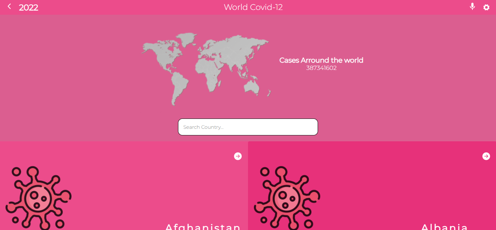
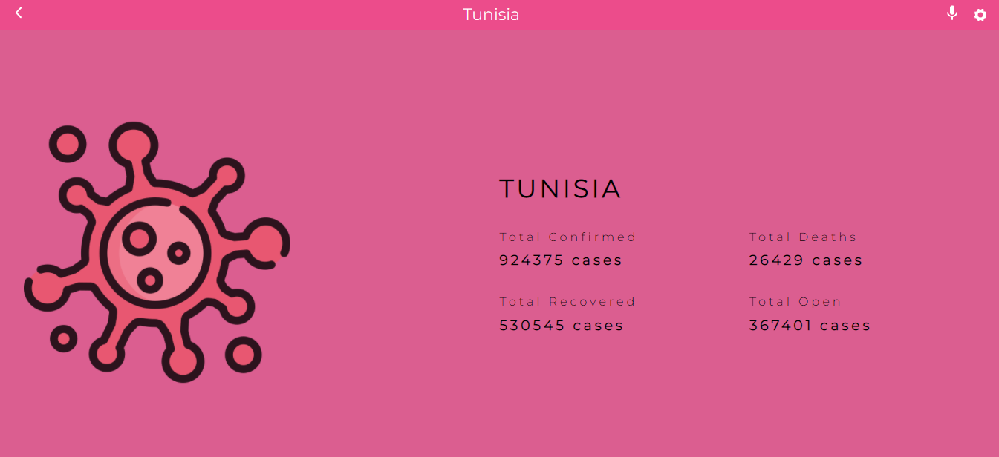
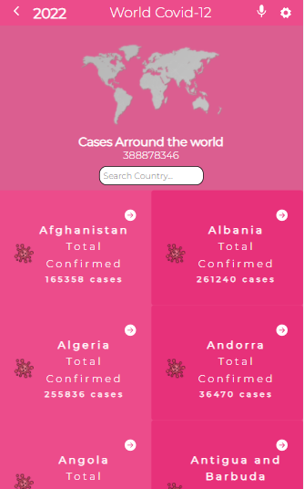

# Covid-19 Metrics
> Covid-19 Metrics App is single-paged application (SPA) that displays statics of Covid-19 arround the world. The data being showcased was fetched from the  [Narrativa_API](https://covid19tracking.narrativa.com/index_en.html). The `Home` page shows the list of countries that could be filtered with the country name. `Details` page show detailed data for a selected country. Every page has a unique route within the SPA.

## Live Server

[Live Link](https://metrics-covid19.netlify.app)

## Video presentation

[Loom_video](https://www.loom.com/share/ee8fc004447c4270831998244d3dd0ff)

## Screenshots
### Home

### Details

### Mobile version

## Getting Started

To get a local copy up and running follow these simple steps.

- You can clone this repo by typing `https://github.com/NasKhalil/Metrics-capstone-project.git` on your terminal.

- Type `cd Metrics-capstone-project` to access the project on the terminal.
  
- Run `npm install` from your editor's terminal.

- Run `npm start` from your editor's terminal to run the app in the development mode.

- Run `npm run build` to build the app for production.

## Language Used:

This project was bootstrapped with [Create React App](https://github.com/facebook/create-react-app).

Redux

## Version Control System

GIT

## 👤 Authors

👤 Khalil Nasri

GitHub: [@NasKhalil](https://github.com/NasKhalil)

LinkedIn: [Khalil Nasri](https://www.linkedin.com/in/nasri-khalil-androdev/)

## 🤝 Contributing

Contributions, issues, and feature requests are welcome!

Feel free to check the [issues page](https://github.com/NasKhalil/Metrics-capstone-project/issues).
Feel free to check the [Projects page](https://github.com/NasKhalil/Metrics-capstone-project/projects).

## Acknowledgments

- This design inspired by [Nelson Sakwa](https://www.behance.net/sakwadesignstudio) on Behance.

## Show your support

Give a ⭐️ if you like this project!

## 📝 License

This project is [MIT](LICENSE) licensed.